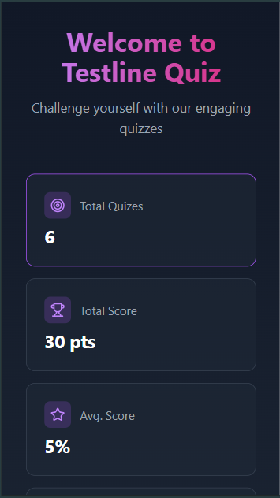
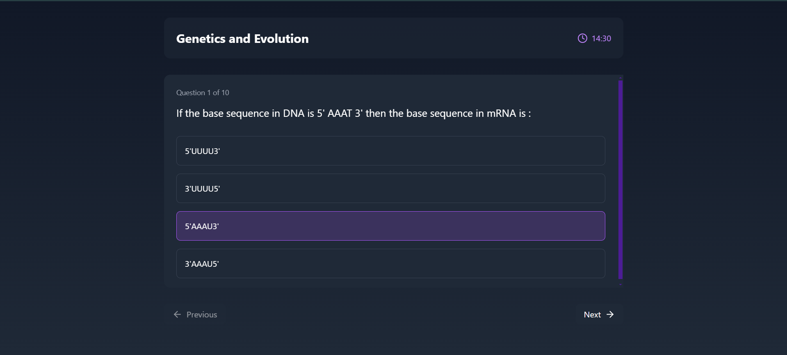

# Testline Quiz Application

A modern, responsive quiz application built with React, TypeScript, and TailwindCSS. Take quizzes, track your progress, and review your performance with detailed analytics.

## 🎥 Demo

## ✨ Features

- **Interactive Quiz Interface**
  - Real-time answer selection
  - Timer for each quiz
  - Smooth navigation between questions
  - Progress tracking

- **Detailed Analytics**
  - Score calculation with negative marking
  - Performance statistics
  - Wrong answer review system
  - Historical quiz attempts tracking

- **Modern UI/UX**
  - Responsive design for all devices
  - Custom scrollbars
  - Smooth animations
  - Dark theme optimized

## 🚀 Tech Stack

- React + TypeScript
- TailwindCSS for styling
- Lucide Icons
- React Router for navigation
- Local Storage for data persistence

## 📸 Screenshots

### Home Page

### Quiz Interface

### Results Summary

## 🛠️ Setup & Installation

1. Clone the repository:
`git clone https://github.com/MayankChandratre1/testline_web.git`

2. `cd testline_web`
3. `npm install`
4. `npm run dev`
5. You can see results at `http://localhost:5173`
